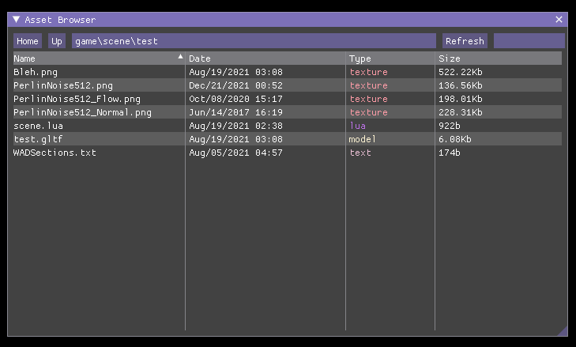
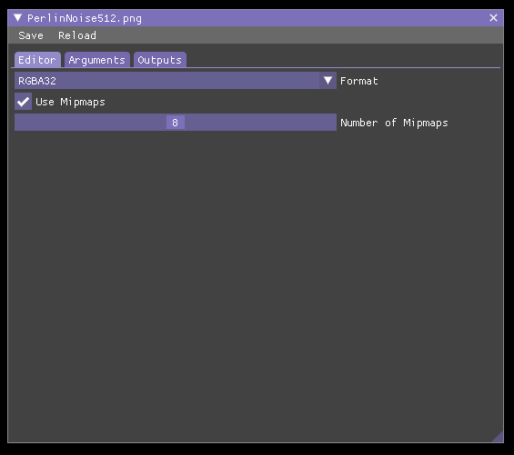
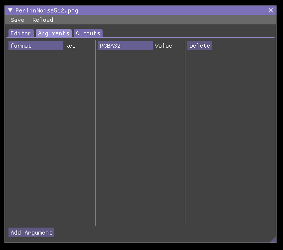
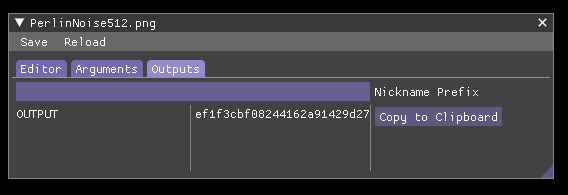

# Artist Guide for Citrus Toolbox

This document will cover the various procedures and best practices when creating art assets for citrus toolbox.

## Audition

Audition in Citrus Toolbox reffers to the suite of tools accessible in development builds. Audition can inspect the internal state of the engine, facilitate playtesting features, hot reloads, live links, and provides asset editors and importing windows. It is accessible via `Ctrl+Grave` (the key above tab but next to 1 on QWERTY).

## Asset Compiler

Assets in Citrus Toolbox must be compiled down from a artist friendly format to a engine friendly format. This process is done using the asset compiler. The asset compiler is built using Python with the WAF framework, so it can be easily extended to fit the needs of production. Here are the following terms used to reffer to what you might think of as assets in the engine and what they reffer to:

Assets: designer friendly and artist friendly files that come from external programs or the asset editors. Assets once checked into the compiler will have sidecar ".ctac" files, these store outputs, nicknames, and compilation settings for each asset. (ex: .png, .gltf, .json)

Data: assets get compiled down to engine friendly files that can be accessed by the engine, these files might be packaged in production builds or loose files in development builds. These files are located at the build folder for the application. Although they come from assets, all the info about file names, file paths, and extensions are stripped out as they are no longer relevant. Assets are now accessed by GUIDs (globally unique identifiers) or by nicknames assigned to the asset and their outputs.

Resources: resources are the final stage of the pipeline, this reffers to data (which comes from assets) that have been loaded into memory via the resource manager and are now reference checked and accessible in a programmer friendly way.

The asset compiler can be launched in multiple ways:

1. From a batch file on the root of the asset folder
2. From Visual Studio/Other IDEs as part of the CMake Project
3. Inside builds which includee auditions `Assets->Compiler`

## Using the Asset Browser

The asset browser is accessible via `Assets->Browser` in development builds with audition open. and is basically a custom file browser that has context about what assets are. Only once assets are checked in via running the compiler do they show up here. 



When you double click on an asset it opens up its associated editor. Editors have multiple sections:

### Editor

This varies from asset to asset. For text files it will be a text editor: for models and textures it will be an import window, and for more citrus specific assets it will be fully fledged node or property editors. Here we just have the import options for a texture.



### Arguments

The args editor contains a list of arguments that will be passed to the compiler, you can manually edit, add or delete them here.



### Outputs

The output window is where you assign a programer accissible nickname and can view the outputs that will be created once the asset is compiled.



## Textures

The assset compiler supports jpeg and png formats for texture assets. Textures will be written out as .ktx files. Textures are generated using compressonator, see [documentation](https://compressonator.readthedocs.io/en/latest/) for specific details.

The engine can open ktx, dds, and many other formats (with limitations) but the asset compiler will only generate ktx files.

## Shaders

Shaders are written using a shading language specific to Citrus Toolbox. See [ShadingLanguage.md](../ShadingLanguage.md) for more details.

## Models

The asset compiler supports processing gltf models (with a limited subset of features) into an engine specific model format. 

### Mesh Modeling

* You must not exceed 65536 vertices per submesh/primitive. Split a mesh into multiple meshes or material slots if you reach this vertex count.
* Vertex position precision are limited to 1/65536th of the bounding box for each axis. This is usually inperceptible on most objects but for large level geometry you should split up the mesh into tiles. It is possible that this precision limit might cause very small gaps to appear in meshes so always try to use a light catcher mesh and gap covering techniques on indoor modular environments where gaps may be noticable.
* Vertex normals will snap to rougly 0.35 degree increments. When interpolated and possibly using normal maps this may appear higher, but avoid creating meshes with a very high number of subdivisions as this can introduce subtle faceting.
* Avoid flipped normals, negative scaling, and keep object scale applied as much as possible.

### LODs
* LODs can be created in the modeling program by creating a child of a mesh with a `_LOD#` prefix (where # is a number from 1 to 3)
* LODs often form an exponential drop in screen size, here is a rule of thumb to keep in mind.
    * LOD0: this is your base mesh
    * LOD1: the mesh should start to collapse holding loops for shading and small details but avoid changing the siloutte too much.
    * LOD2: the siloutte can be simplified and any fine details should be gone
    * LOD3: aggressively simplify, if its not noticable at "pin size" then the detail, geometry should be removed.
* Often time it doesn't make sense to create all LODs, for medium-low poly meshes you probably can get away with one level or none.
* LODs can be automatically generated by the asset compiler but this option should be viewed as a time saving option for insignificant but decent polygon count assets.

### Skinning
* Each vertex will only be influenced by up to 4 bones. This is a common practice in games and is likely not an issue for most rigs. If you need more subtle detail consider using corrective shape keys.

### Morph Targets
* Combining morphs with LODs is supported but often takes up a lot of space. Use as few morph targets as possible and experiment with ways of combining them.
* Morph targets can also change vertex colors in Citrus but in Blender this is not supported yet.

### Scatters
Todo

### Skeletons
* When the scene is exported and skeletons are tagged for export all gltf nodes (objects) will be treated as a bone. 
* Armatures/Skeletons/Rigs in your modeling package MUST have their root rotation and scale applied or else skinning will likely be messed up. These issues can be introduced by animated models imported from another format.

### Animations
* The asset compiler doesn't make many changes to animation data outside of removing empty channels, consult any gltf reference material on animation for more info.
* Animations will be resampled into linear or stepped interpolation from more advanced interpolation types used in your animation package. Assume each frame passed is a keyframe on each bone active in the animation at worst case.
* Cubic interpolation is currently not supported in Citrus for animations
* Custom animation channels are created by keyframing the local X translation channel of an object that has the name of the channel followed by the `_CAP` postfix.

### Splines
Splines (or curves) are supported in citrus toolbox for gameplay purposes.
* Splines are marked with the `_SPLN` postfix and are expected to have `CITRUS_node_spline` extension data.
* In the blender exporter only one spline (separated curve) is exported per object.
* Splines can be cyclic/acyclic and linear/cubic.
* Splines will be resampled from control points in the modeling package into many segments.
* Consult the gameplay programmer for any requirements they have for the curve data.

### Collision
Each node that has a name which ends in the following will be considered a collision mesh:
* `_CBX`: box
* `_CSP`: sphere
* `_CPL`: capsule
* `_CTR`: triangle mesh
* `_CVX`: convex hull

(unreal naming scheme is also supported)

#### Guidelines
* The pivot is considered the center of mass. If the pivot is offcentered, the center of mass is offcentered on non-compound shapes.
* All shapes can be used to create compound shapes by having more than one assigned to a single visible mesh parent.
* No more than 64 subshapes may be assigned to a single parent
* Avoid shapes which are smaller than 0.05 meters as much as possible

#### Boxes, Spheres, and Capsules
* Uses the bounding box of the mesh, or the scale of the node if no mesh is present as the dimensions of the shape.
* Rotate on an object level, not a mesh level. Rotated mesh vertices will just change the size of the bounding box.
* The actual shape of the mesh used is just a visual aid, only the bounding box matters.

#### Triangle Mesh
* Keep the scale of the model applied
* Keep normals all pointed outwards
* You can assign multiple materials to this shape unlike the others

#### Convex Hull
* Keep the point cound low
* The input mesh does not need to be convex, the compiler will do this for you.

#### Physics Materials
All physics materials have the prefix `CM_`, these will not be exported as a renderable material. The name following should be one of the ones found in `PhysicsSurfaces.json`

### Navmesh

Todo

### Level Creation

Todo

### Import Options

Todo

### GLTF Core Support

* ONLY Separate GLTF+BIN is tested to work
* All nodes MUST have names
* Compressed or sparse meshes is NOT supported
* ONLY indexed triangle list primitives are supported
* All primitives MUST have positions
* ALL (shaded) primitives MUST have normals (will not be calculated automatically)
* Submeshes MUST NOT exceed 65536 vertices
* ONLY up to 4 uv and 4 color attributes are supported
* Skinning is ONLY supported on models up to 65536 bones
* Texture rotation as a material property is NOT supported
* Texture sampling options (wrapping/filtering) is NOT supported
* Each primitive must have the same number of morph targets as the mesh contains target names (no idea why this mismatch can occur)
* Unlisted extensions are ignored and can lead to misbehavior
* Various edge cases of the GLTF spec are often ignored

### GLTF Extensions Support
* KHR_lights_punctual
* KHR_texture_transform (no rotation)
* EXT_mesh_gpu_instancing (see scattering)
* KHR_materials_emissive_strength
* KHR_materials_ior
* KHR_materials_unlit
* KHR_materials_volume (no thickness texture)
* KHR_materials_transmission

### GLTF Internal Extensions

#### CITRUS_node_spline

On a node:
```json
"extensions":{
				"CITRUS_node_spline":{
					"type":"linear-or-cubic",
					"cyclic":true,
					"attributes":{
						"POSITION":0,
						"NORMAL":1,
						"TANGENT":2
					}
				}
			}
```
Will generate additional accessors (expected to be all vec3s)

### Citrus Model Format

The citrus model format is designed to be an archive for most data that can possibly come from a 3D modeling application. The format can be conceptualized as a tree like this:

* Skeleton
    * Bones
* Geometry
    * Meshes
        * LODs
            * Submeshes
            * Morph Target Implementations
        * Morph target definitions
    * Scatters
* Animation
    * Clips
        * Channels
            * Keyframes
* Splines
    * Segments
        * Points
* Material Set
    * Material
        * Properties
* Physics
    * Collision Shapes
    * Constraints
* Navmesh
* Scene Script
* GPU Data
    * Vertices
    * Indices
    * Etc...

 (programmers note: implementation does not reflect this exactly, see `Model.hpp` for details)